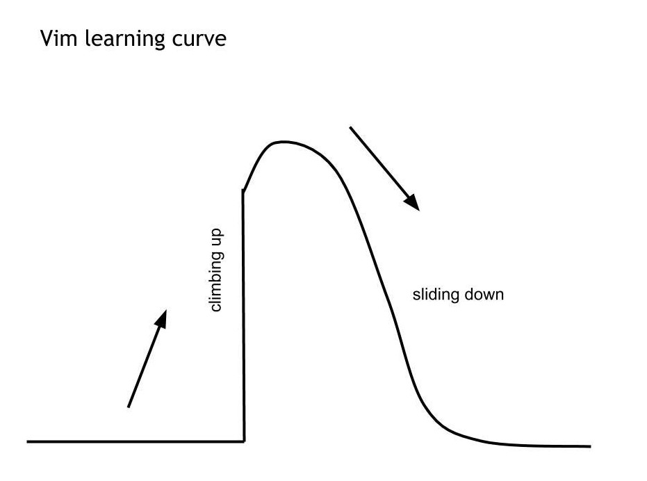

# 2024 Goals

Stepping into 2024, I was presented with numerous opportunities that allowed me to uncover my passion for **web application security/development**. I delved deeper into this field through platforms like [<mark style="color:orange;">TryHackMe (THM)</mark>](https://tryhackme.com/path/outline/web), [<mark style="color:orange;">Hack The Box (HTB)</mark>](https://academy.hackthebox.com/course/preview/introduction-to-web-applications), [<mark style="color:orange;">PortSwigger</mark>](https://portswigger.net/), and by studying CTF write-ups of others.\
\
Another goal of mine was to continue pursuing my love for **forensics** and learning more from it!

\
These are some of the goals I wish to acheive (big and small) hopefully by the end of 2024.

* Being more pro-efficient in Python, Flask, SQL, JS, React, Typescript, PHP
* Improve my Git/Github Version Control skills and Docker
* Touch Vim 😲
* Achieve better placing for CTF's // Go to BrainHack Finals
* Get a Scholarship..?

Some things that I have started to do out of my comfort zone was starting to apply to more Internships and talking to more people in this field!

<figure><figcaption>
I thought this was funny..
</figcaption></figure>
